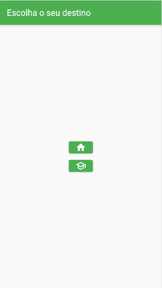
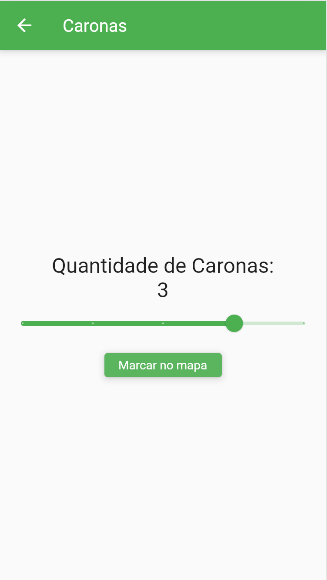
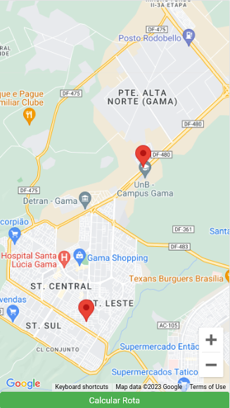
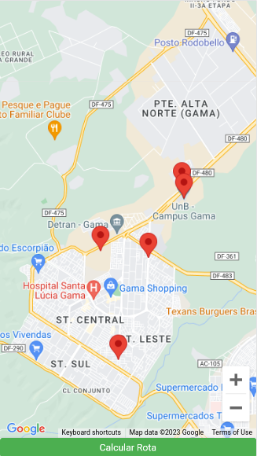
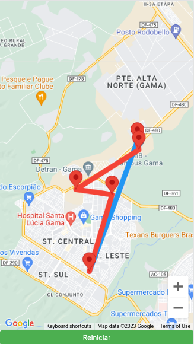

# Grafos2_rota_carona

**Número da Lista**: 4 
**Conteúdo da Disciplina**: Grafos 2 

## Alunos
|Matrícula | Aluno |
| -- | -- |
| 14/0158278  |  Pedro Helias Carlos |
| 17/0069991	 |  João Victor Max Bisinotti de Oliveira |

## Vídeo de Apresentação
https://unbbr.sharepoint.com/:v:/s/Algoritmo262/ER87x-LWtWBBsk3paFtw5IIBLcxyFLAgIynQybl1cPR6eQ?e=GhgT2A

## Sobre

O objetivo do projeto Carona é ser um aplicativo pessoal de caronas, no qual o usuário pode selecionar seu destino (casa ou faculdade) e indicar quantas caronas dará naquela viagem (até 4). O aplicativo então exibe um mapa no qual o usuário  coloca marcadores para indicar as localizações das caronas. Os pontos de origem e destino já estarão marcados no mapa.
Após os marcadores terem sido colocados no mapa, o usuário pode clicar em um botão para calcular a rota. O aplicativo calculará duas rotas diferentes: uma rota entre o destino final e o ponto de partida original(azul) e outra rota que inclui as caronas(vermelha). Ambas as rotas serão desenhadas no mapa, permitindo que o usuário visualize o trajeto.

## Screenshots

## Instalação
**Linguagem**: Dart 
**Framework**: Flutter 

1. Instale o Flutter em seu computador seguindo os passos descritos na documentação oficial: https://flutter.dev/docs/get-started/install
2. Clone o repositório do projeto em sua máquina
3. Execute o comando `flutter pub get` no diretório raiz do projeto para instalar as dependências necessárias
4. Conecte seu dispositivo móvel ao computador ou inicie um emulador de dispositivo móvel ou selecione o navegador(Chrome(web)) como Flutter Device.
5. Execute o comando `flutter run` no diretório raiz do projeto para iniciar o aplicativo

## Uso
Após executar o aplicativo, o usuário deve informar seu destino.
Em seguida deve informar quantas caronas vai dar(0 a 4). 
Então terá que marcar os locais das caronas no mapa, caso hajam.
Clica no botão 'Calcular rota' e visualiza no mapa o desenho das rotas.
Clica no botão 'Reiniciar' para recomeçar.

